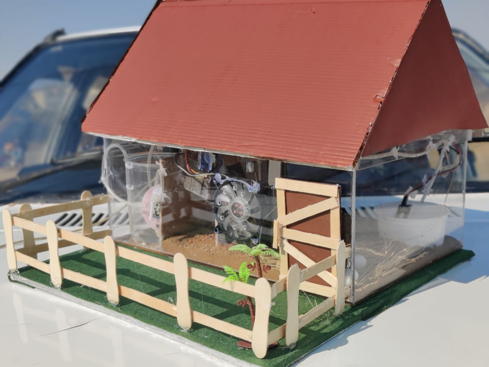
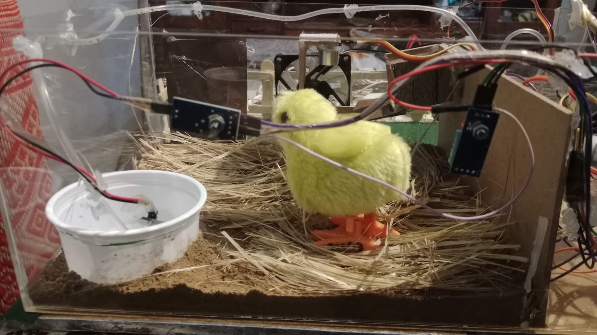
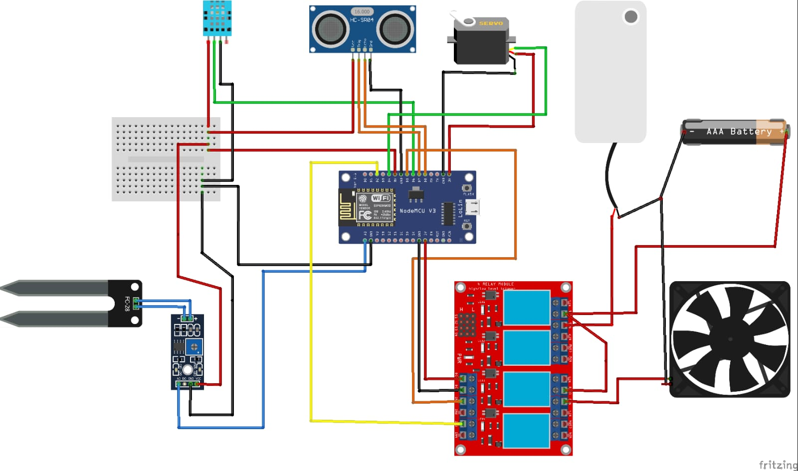
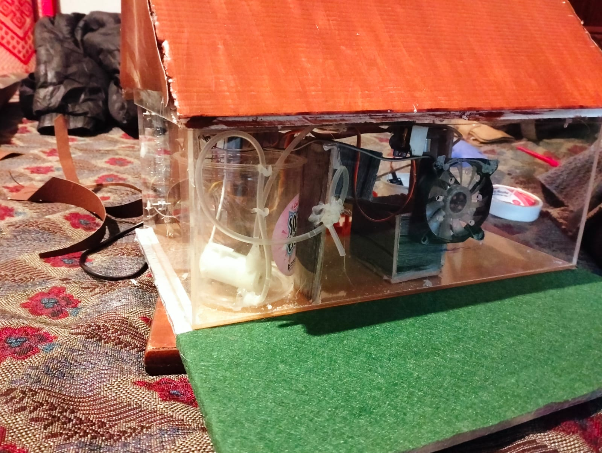

# Smart Hen Farm

An automated poultry shed that feeds, waters and ventilates itself.



Three sensors watch the shed, three actuators act on it, and nothing needs a person standing
there. Grain runs low and the hopper gate opens until the tray is full again. The drinker
empties and it refills. The shed gets too warm and the exhaust fan runs until it cools.

A phone app shows the live readings and raises an alert when something needs attention.

```
temperature ─┐                              ┌─→ exhaust fan   (relay)
humidity   ──┼─→  NodeMCU ESP8266  ─────────┼─→ hopper gate   (servo)
feed level ──┤     read → decide → act      ├─→ water valve   (relay)
water level ─┘         └─ verify ─┘         └─→ Firebase → phone app
```

---

## The three control loops

Each loop is closed. It acts, then keeps reading until the sensor confirms the target state,
then stops. None of them run on a timer.

| Loop | Sensor | Actuator | Starts when | Stops when |
|---|---|---|---|---|
| **Feed** | HC-SR04 ultrasonic above the feed tray | SG90 servo on the hopper gate | Tray reads empty | Tray reads full |
| **Water** | FC-28 probe in the drinker | Submersible pump via relay | Drinker reads empty | Drinker reads full |
| **Climate** | DHT11 temperature and humidity | DC exhaust fan via relay | Temperature above the limit | Temperature back in range |



*Drinker with the level probe on the left, feed area and sensor modules on the right, exhaust
fan at the back.*

### Why closed-loop rather than timed

A timed feeder dispenses whether or not the birds ate, so it either overflows the tray or
starves them when they eat faster than expected. Measuring the tray and stopping when it is
full means the same code works regardless of flock size or appetite.

---

## Hardware

| Part | Purpose |
|---|---|
| NodeMCU V3 (ESP8266) | Controller and WiFi |
| DHT11 | Shed temperature and humidity |
| HC-SR04 ultrasonic | Feed tray level, measured as distance to the grain surface |
| FC-28 probe with LM393 comparator | Drinker water level |
| SG90 servo | Hopper gate |
| 4-channel relay module | Exhaust fan and water pump |
| Submersible pump | Refills the drinker from the reservoir |
| DC fan | Exhaust |



> **[fill]** Pin map. Read it off the diagram and put it in a table here, since that is the
> first thing anyone rebuilding this will look for.

**Power the servo and relays from their own 5V rail, not from the NodeMCU's regulator.** The
servo draws a current spike when it starts moving, and sharing the rail browns out the ESP
mid-write. Common ground between the two supplies.

---

## Control logic

```
every loop:
    read temperature, humidity, feed distance, water state
    push readings to Firebase

    if temperature > TEMP_ON        -> fan on
    if temperature < TEMP_OFF       -> fan off

    if feed_distance > TRAY_EMPTY   -> servo to GATE_OPEN
    if feed_distance < TRAY_FULL    -> servo to GATE_CLOSED

    if drinker reads empty          -> valve open
    if drinker reads full           -> valve closed
```

**Thresholds**

| Constant | Value | Note |
|---|---|---|
| `TEMP_ON` | **[fill]** °C | Fan starts |
| `TEMP_OFF` | **[fill]** °C | Fan stops. Must be below `TEMP_ON`, see below |
| `TRAY_EMPTY` | **[fill]** cm | Distance from sensor to grain when the tray needs filling |
| `TRAY_FULL` | **[fill]** cm | Distance when full |
| `GATE_OPEN` | **[fill]**° | Servo angle that clears the hopper mouth |
| `GATE_CLOSED` | **[fill]**° | Servo angle that seals it |

### Two things worth knowing if you rebuild this

**Use a gap between the on and off thresholds.** If the fan switches on and off at the same
temperature, it chatters near that point: the relay clicks continuously and the fan starts and
stops every few seconds, which wears both out fast. Separating them by a couple of degrees
means the fan runs a while before it stops.

**Average the ultrasonic reading before acting on it.** Grain settles unevenly and dust
scatters the pulse, so single readings jump around. Taking the median of several samples stops
the gate opening because of one bad measurement.

> **[confirm]** Whether the current firmware does both. If it does, say so here. If it does
> not, that belongs under Known limits rather than being quietly left out.

---

## Setup

```bash
# 1. Arduino IDE, add the ESP8266 board URL under Preferences:
#    http://arduino.esp8266.com/stable/package_esp8266com_index.json
# 2. Install libraries: DHT sensor library, Servo, FirebaseESP8266
# 3. Copy the config template and fill it in
cp src/config.example.h src/config.h
```

`config.h`:

```cpp
#define WIFI_SSID       "your-network"
#define WIFI_PASSWORD   "your-password"
#define FIREBASE_HOST   "your-project.firebaseio.com"
#define FIREBASE_AUTH   "your-database-secret"
```

`config.h` is gitignored. Do not commit real credentials.

Flash the board, open the serial monitor at 115200, and confirm the readings look sane before
connecting anything to mains.

> **[confirm]** Library names and the actual config mechanism.

---

## The app

**[fill]** What it is built with, what it shows, and how it authenticates. Screenshot or a short
clip here would do more than the description.

---

## Safety

The fan and the water valve switch mains-adjacent loads through relays. Two rules:

- Wire and test the low-voltage side completely before anything is connected to mains.
- The relay module must be optically isolated, and mains wiring should be enclosed and out of
  reach of the birds and of water.

This is a working model, not a certified installation.

---

## Known limits

- **Fail-safe on connection loss is not defined.** If the ESP resets or loses WiFi while the
  hopper gate is open, the intended behaviour should be to close the gate and shut the valve.
  Verify what the firmware currently does, because an open gate on a hung controller empties
  the hopper into the tray.
  **[confirm whether this is handled, then move it out of this list]**
- **The FC-28 is a soil probe used as a water-level sensor.** It works, but its exposed
  electrodes corrode in standing water within weeks because continuous DC through the
  electrodes electrolyses them. Powering the probe only during a reading extends its life a
  long way. A float switch or a capacitive probe is the proper fix.
- **Ultrasonic sensing struggles with a sloped grain surface.** It measures the nearest point,
  not the average, so a mound under the hopper mouth reads full while the edges are empty.
- **No local fallback.** Control decisions run on the device, but readings and alerts depend on
  the network, so a WiFi outage means no visibility even though the loops keep running.
- **Single shed, single flock.** Nothing here scales to multiple sheds without reworking the
  data model.

---

## Project layout

```
src/
  main.ino            control loops
  config.example.h    credentials template
  sensors.*           DHT, ultrasonic, water probe
  actuators.*         servo gate, relay control
  app/                  mobile monitoring app
  docs/                 wiring diagram, photos
```

> **[confirm]** Replace with the real structure.

---

## Gallery

| | |
|---|---|
|  |  |
| The finished model | Reservoir, tubing, servo and fan through the acrylic wall |

---

## Image references

- docs/build-exterior.jpg — Used at the top of the README and in the Gallery as "Exterior". Photo showing the finished exterior of the model.
- docs/build-interior.jpg — Used in "The three control loops" section as "Interior". Shows the drinker with the level probe (left), feed area and sensor modules (right), and the exhaust fan at the back.
- docs/wiring-diagram.jpg — Used in the Hardware section as the wiring diagram; contains the pin map and connections (use this to extract the pin table mentioned in the README).
- docs/build-side.jpg — Used in the Gallery as "Side"; shows reservoir, tubing, servo and fan mounted through the acrylic wall.

If you add or rename images, update these paths to keep the references correct.

---

## Fill these in before publishing

1. The pin map, read off the wiring diagram
2. The six threshold constants
3. Whether hysteresis and reading-averaging are implemented
4. Whether the gate fails closed on reset or WiFi loss
5. What the mobile app is built with
6. A short clip of the gate cycling, which is the one thing the photos cannot show
